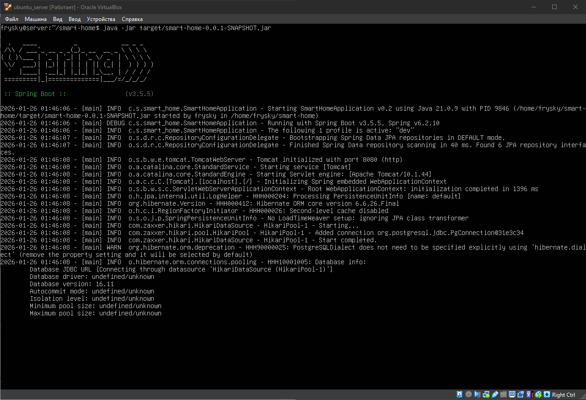
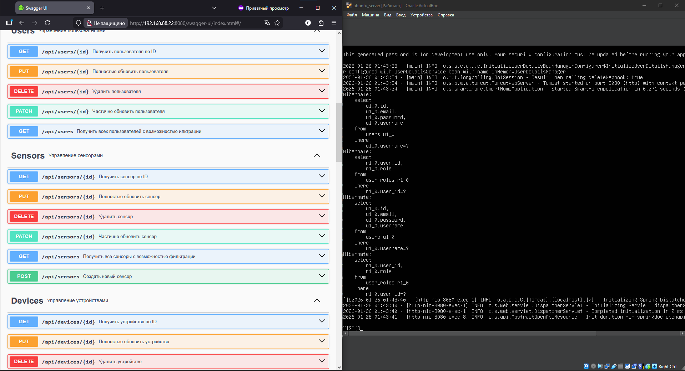

# Smart Home System

Система управления умным домом с поддержкой автоматизации, Telegram-уведомлений и генерации PDF-отчетов.
## Основные возможности
* **Управление устройствами:** Добавление, удаление и мониторинг состояния датчиков и девайсов.
* **Автоматизация:** Создание правил (например: если температура > 30°C, включить кондиционер).
* **Telegram Bot:** Уведомления о критических событиях в реальном времени.
* **Отчеты:** Генерация PDF-отчетов о работе системы.
* **Безопасность:** Ролевая модель доступа (RBAC) и аутентификация через JWT.

## Скриншоты



Отчет в форматах .docx и .pdf лежит в каталоге `screenshots/`
## Настройка и запуск

### Требования
* JDK 21
* PostgreSQL

### Переменные окружения
Создайте файл `.env` на основе `.env_example` и заполните своими данными.

### Сборка и запуск
```bash
mvn clean package -DskipTests
java -jar target/smart-home-0.0.1-SNAPSHOT.jar
```